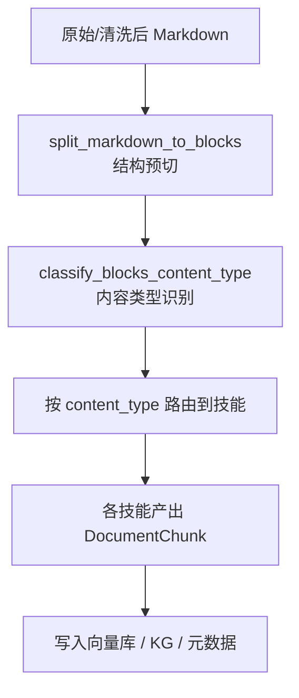

# GB 标准类 Markdown 自适应切分设计

> **目标**：基于 GB 标准 / 食品添加剂等规范类 Markdown 文档，在不损坏原始语义与数值的前提下，按内容类型进行自适应切分，既支持高质量问答，又为后续规则推理 / 合规检查预留结构化空间。

---

## 一、背景与问题

- 现状：
  - MinerU 从 PDF 转出的 GB 标准类 Markdown 在排版上存在问题（标题重复/错级、HTML 表格、LaTeX 空格异常等），但正文内容是可靠的。
  - 当前知识库切分策略（如纯文本分段）难以充分利用这些标准文本中的「规则/指标/公式」等结构化信息，问答时经常命中一大坨文本，粒度不合适。
- 目标：
  - 在 **不改动正文内容（文字和数字）** 的前提下，先对 Markdown 做安全清洗，再根据内容类型进行 **粗粒度但语义清晰** 的切分：
    - 描述 / 说明类 → 段落型 chunk；
    - 范围 / 定义类 → 定义型 chunk；
    - 理化指标 / 限量 / 指标表 → 规则型或 QA 型 chunk（以条款/行为单位）；
    - 公式 / 计算方法 → 公式+变量解释为一体的 chunk；
    - 检验方法步骤 → 小节整体为单位的流程型 chunk。
  - 提供一套 **Agent + Skills（Tools）** 的可插拔架构，每种 `content_type` 对应一个技能，便于后续扩展与重用。

---

## 二、整体处理流水线

### 2.1 从 MinerU 到清洗后的 Markdown

1. **PDF → Markdown（MinerU）**
   - `pdf_to_markdown(pdf_path)`：调用 MinerU 本地服务，将 PDF 转为 Markdown 字符串。
2. **MinerU Markdown 安全清洗**
   - `clean_mineru_markdown(markdown: str) -> str`：
     - 只做排版级别的修复：
       - 规范标题格式与空行（`#` + 空格 + 标题；标题前后至少一行空行）；
       - 将 `<table>...</table>` 转为 GFM 表格（仅去除/替换 HTML 标签，不改单元格文字）；
       - **不修改任何正文文字和数字**。
     - 可选：在规则清洗结果上使用 LLM 做排版增强，配合「纯文本签名比对」确保不改动内容，否则回退。

清洗阶段的输出是一个 **结构合理但语义未切分** 的 Markdown，后续作为 Agent 自适应切分的输入。

### 2.2 自适应切分流水线

整体流程（逻辑层）：



1. **结构预切 (`split_markdown_to_blocks`)**
   - 利用标题（`#` ~ `######`）、章节号（如 `1 范围`、`3.2 理化指标`、`A.4.5 结果计算`）等，将全文切成若干 **Block**：
     - 每个 Block 尽量对应一个「自然小节」或「表格」。
2. **内容类型识别 (`classify_blocks_content_type`)**
   - 使用 LLM 对每个 Block 做粗粒度分类，得到 `block_id -> content_type`。
3. **按类型路由到技能**
   - 通过一个技能注册表 `content_type -> handler_skill`，将 Block 分发给对应技能进行细致切分与 QA 化。
4. **产出最终 `DocumentChunk` 列表**
   - 各技能返回一组 `DocumentChunk`，包含：
     - `content`：最终入库文本（原文 + 必要的 QA 句）；
     - `metadata`：`doc_id`, `markdown_id`, `heading_path`, `content_type`，以及可选的结构化规则 JSON。

---

## 三、内容类型设计（content_type）

为保持可扩展性和简单性，按 GB 标准类文本的典型结构设计以下 `content_type`。其中部分类型可以在第一版中暂时不完全实现，但需要在设计上预留：

- **通用类**
  - `narrative`：一般描述/前言/背景/说明；
  - `scope`：适用范围条款；
  - `definition`：术语或名词解释；
- **规则 / 指标类**
  - `specification_text`：文字形式的技术要求/限量/指标条款；
  - `specification_table`：表格形式的技术指标、理化指标、限量表；
  - `method_performance`：方法学性能指标，如检出限（LOD）、定量限（LOQ）、精密度、回收率、线性范围等；
- **公式 / 方法类**
  - `calculation_formula`：计算公式 + 变量解释段落；
  - `test_method` / `method_step`：检验/测定方法的小节（如「5.1 试样预处理」「A.5.2 分析步骤」）。
    - 实现时统一使用 `test_method` 作为 `content_type` 值，`method_step` 仅作为文档中的语义别名。
- **可选清单/资源类（后续版本可逐步引入）**
  - `instrument`：仪器与设备（如沙门氏菌标准中的设备列表）；
  - `reagent`：试剂与材料/培养基/缓冲液；
  - `note`：注释说明；

此外，还可以在 `metadata` 中使用更细的“子类别”字段来区分某些规则类型（例如标签要求/贮存条件），而不必在 `content_type` 上继续爆炸式扩展，从而兼顾简单性与表达能力。

---

## 四、各内容类型的切分与表达策略

### 4.1 描述 / 说明（`narrative`）

- **来源**：前言、说明性文字、背景描述等。
- **切分策略**：
  - 按自然段或小节切分；
  - 每一段或一小组紧密相关的段落作为 1 个 chunk；
  - 不再向下拆分句子。
- **用途**：
  - 解释性问答、背景补充。

### 4.2 适用范围（`scope`）

- **来源**：标准中的「1 范围」章节。
- **切分策略**：
  - 「1 范围」整体作为 1 个 chunk；
  - 内部保留原文；可附一条 QA 句（不额外拆 chunk）。
- **典型 QA**：
  - Q: 本标准适用于哪些产品/原料/加工方式？
  - A: 直接引用范围条款中的句子。

### 4.3 名词解释 / 术语定义（`definition`）

- **来源**：术语和定义章节、相对分子质量、分子式说明等。
- **切分策略**：
  - 每个术语或关键定义 = 1 个 chunk；
  - 保持「术语 + 定义」为一个整体。
- **chunk 内部结构建议**：
  - 顶部明确写出术语；
  - 原文定义原样保留；
  - 可附一条 QA：
    - Q: “什么是 XXX？”  
      A: 引用定义内容。

### 4.4 理化指标 / 限量条款（`specification_text`）

- **来源**：用文字直接规定的技术指标或限量（非表格）。
- **切分策略**：
  - 每一条明确的规则/条款 = 1 个 chunk；
  - 原文条款保留 + 1–2 条 QA 风格句子；
- **典型 QA**：
  - Q: 某类食品中某物质的最大含量是多少？
  - A: 数值范围 + 单位 + 引用条款位置。

### 4.5 表格类指标（`specification_table`）

- **来源**：如「表1 感官要求」「表2 理化指标」等。
- **切分策略**：
  - 先将 HTML/GFM 表格解析为二维数组；
  - 为每张表（包括“续表”）生成一个稳定的 `table_id`（如 `"GB8821-2011-表2"`），主表与续表共享同一 `table_id`；
  - **按行切分**：每一行（对应一个“项目/食品类别/指标组合”） = 1 个 chunk；
  - 不拆表头单独成 chunk，表头信息在每行描述中复用。
- **chunk 内容**：
  - 原始表头与当前行内容（原文保留）；
  - 由 LLM 或规则生成的自然语言规则描述；
  - 1–2 条 QA 句（方便问答召回）。
- **可选结构化元数据**：
  - 在 `metadata` 中保存 `rule_json` 或 `table_row_json`，包含：
    - `table_id` / `table_title` / `item` / `food_category` / `limit_value` / `unit` / `method_ref` 等；
  - 为后续规则推理、数值比对提供基础。

> 注：对于方法条件类表格（例如梯度、色谱条件等），也可以复用 `specification_table` 类型，但在 `rule_json` 中以 `rule_kind = "method_condition"` 与产品限量规则区分开。

### 4.6 方法学性能（`method_performance`）

- **来源**：方法标准中的“检出限”“定量限”“精密度”“回收率”“线性范围”等性能指标条款。
- **切分策略**：
  - 每一条性能指标 = 1 个 chunk；
  - 原文保留 + 1 条简洁 QA 描述；
  - 与方法（如“第一法 液相色谱法”）通过 `section_path` 和额外元数据显式关联。
- **典型 QA**：
  - Q: 乙氧基喹测定方法的检出限是多少？
  - A: 检出限为 0.01 mg/kg，定量限为 0.02 mg/kg（示例），依据某章节。
- **结构化元数据建议**：
  - `rule_json` 中包含：
    - `metric_type`（如 `"LOD"`, `"LOQ"`, `"precision"`）；
    - `metric_value` / `unit`；
    - `target_analyte` / `matrix`（若能可靠抽取）；
    - `method_id` 或 `method_name`（如 `"第一法 液相色谱法"`）。

### 4.7 公式与计算（`calculation_formula`）

- **来源**：如「A.4.5 结果计算」中给出的公式及变量解释。
- **切分策略**：
  - **公式 + 变量解释** 作为一个整体 chunk；
  - 不再把变量解释逐条拆成多个 chunk，以免丢失整体语境。
- **chunk 内容**：
  - 公式以 Markdown 数学环境（`$$...$$`）呈现；
  - 每个变量按「符号 + 含义 + 单位」列出；
  - 可附公式解释 QA：
    - Q: 如何计算样品中 X 的含量？
    - A: 公式文本 + 对变量的简要说明。

### 4.8 检验/测定方法步骤（`test_method` / `method_step`）

- **来源**：如「5 分析步骤」「5.1 试样预处理」「A.5.2 分析步骤」等。
- **切分策略**：
  - 按小节（如「5.1」「5.2」「A.5.2」）为单位，每小节 1 个 chunk；
  - 在有“第一法/第二法”等多方法结构的标准中，`split_markdown_to_blocks` 需优先以“方法标题”（如「第一法 离子色谱法」）为分组边界，同一方法内的小节不会被混杂到其他方法的 Block 中；
  - 小节内部以有序/无序列表呈现分步操作；
  - 不再拆每个步骤为单独 chunk。
- **用途**：
  - 回答「如何进行某项检验？」；
  - 与指标类 chunk 联动，作为“如何测、测什么”的补充背景。

> 对于包含流程图（如“检验程序见图 1”）的标准，可以在对应方法或总览小节内，由 handler 生成一条「整体流程概述」句子（基于上下文和已知步骤），以缓解图片内容难以直接用于检索的问题。

---

## 五、Agent + Skills 架构设计

### 5.1 抽象数据结构

#### Block（结构预切单元）

- 字段示意：
  - `id: str`：Block 唯一 ID；
  - `heading_path: list[str]`：章节路径（如 `["3 技术要求", "3.2 理化指标", "表2 理化指标"]`）；
  - `raw_text: str`：该块原始 Markdown 文本；
  - `order_index: int`：在全文中的顺序；
  - 可选：`table_html` 或 `table_rows`（对表格类块预解析）。

#### 内容类型标注结果

- `block_id -> content_type`（字符串），如：
  - `"A4_5_result_calc" -> "calculation_formula"`。

#### DocumentChunk（已有类型）

- 已在代码中定义，核心字段包括：
  - `doc_id`, `doc_title`, `section_path`, `content_type`, `content`, `meta`, `markdown_id` 等。

### 5.2 技能注册表：content_type → handler

设计一个简单的技能注册与调用机制，用于将不同 content_type 映射到不同的处理函数（技能）：

```python
from typing import Protocol, List

class Block:
    id: str
    heading_path: list[str]
    raw_text: str
    order_index: int

class ChunkHandler(Protocol):
    def __call__(self, block: Block, *, doc_id: str, doc_title: str, doc_type: str) -> List[DocumentChunk]:
        ...

SKILL_REGISTRY: dict[str, ChunkHandler] = {}

def register_skill(content_type: str, handler: ChunkHandler):
    SKILL_REGISTRY[content_type] = handler
```

注册示例：

```python
register_skill("narrative", handle_narrative_block)
register_skill("scope", handle_scope_block)
register_skill("definition", handle_definition_block)
register_skill("specification_text", handle_spec_text_block)
register_skill("specification_table", handle_spec_table_block)
register_skill("calculation_formula", handle_formula_block)
register_skill("test_method", handle_test_method_block)
```

后续如果新增了 `instrument`、`reagent` 等类型，只需：

1. 实现对应的 `handle_xxx_block`；
2. 在启动时 `register_skill("xxx", handle_xxx_block)` 即可。

### 5.3 Agent 主逻辑（自适应切分总入口）

伪代码示意：

```python
def adaptive_split_markdown(
    md_text: str,
    *,
    doc_id: str,
    doc_title: str,
    doc_type: str,
    options: AdaptiveSplitOptions | None = None,
) -> list[DocumentChunk]:
    # 1. 结构预切
    blocks = split_markdown_to_blocks(md_text, doc_type=doc_type)

    # 2. 内容类型识别（可批量调用 LLM）
    type_map = classify_blocks_content_type(blocks, doc_type=doc_type)  # block_id -> content_type

    chunks: list[DocumentChunk] = []

    for block in blocks:
        ctype = type_map.get(block.id, "narrative")
        handler = SKILL_REGISTRY.get(ctype, handle_narrative_block)
        block_chunks = handler(block, doc_id=doc_id, doc_title=doc_title, doc_type=doc_type)
        chunks.extend(block_chunks)

    return chunks
```

Agent 的职责：

- 封装上述流程为一个「自适应切分工具/技能」；
- 对外只暴露一个简单接口：输入文档 Markdown，输出 `DocumentChunk` 列表；
- 内部根据 `content_type` 自动路由到不同技能，便于扩展。

---

## 六、与现有 KB Pipeline 的集成思路

当前 KB 导入流程核心入口是 `import_file_step`，其中：

- PDF：
  - `import_pdf_via_mineru`：`pdf -> MinerU markdown -> split_heading_from_markdown -> 写入向量库`；
- MD/TXT：
  - `import_markdown` / `import_text`：读入内容 -> 根据切分策略（`structured` 或 `text`）切分 -> 写入向量库。

### 6.1 新增自适应策略 `adaptive`

在 `app/core/kb/__init__.py` 中：

- 增加一个新的策略分支：

```python
def split_step(
    documents: List[DocumentChunk],
    strategy: str,
    *,
    doc_type: str | None = None,
    adaptive_options: AdaptiveSplitOptions | None = None,
) -> List[DocumentChunk]:
    if strategy == "structured":
        return split_structured(documents)
    elif strategy == "adaptive":
        return split_adaptive(
            documents,
            doc_type=doc_type,
            options=adaptive_options,
        )
    else:
        return split_text(documents)
```

### 6.2 `split_adaptive` 的职责

- 对于每个 `DocumentChunk`（单文档整体或大段）：
  - 提取 `content` 作为 Markdown 文本（已通过 MinerU 清洗器处理）；
  - 调用 `adaptive_split_markdown(
        content,
        doc_id=doc_id,
        doc_title=doc_title,
        doc_type=doc_type,
        options=options,
    )`；
  - 汇总所有返回的 `DocumentChunk`；
- 将结果写入向量库和 Neo4j（若有）。

### 6.3 渐进式落地建议

1. **第一阶段**：
   - 先在 **少量 Beta 文档** 上启用 `adaptive` 策略（例如几份食品添加剂标准）；
   - 核查：
     - 是否存在过细/过粗的 chunk；
     - QA-style 文本是否影响召回精度；
     - 数值与单位是否严格一致。
2. **第二阶段**：
   - 把 `adaptive` 作为 GB 标准类文档的默认策略；
   - 对非标准类文档仍使用简单 `text` 策略。

---

## 七、后续扩展方向

- **更细的规则 JSON 结构**：
  - 对 `specification_table` 和 `specification_text`，在 metadata 中维护统一的规则 Schema（如 `subject`, `predicate`, `object`, `unit`, `condition`），便于后续规则推理。
- **自动生成「判定逻辑」草案**：
  - 在规则类 chunk 基础上，为 Agent 自动生成「如何根据检测值判断是否合格」的推理模板。
- **与 GB2760 图谱联动**：
  - 将 `doc_id` 与 GB2760 图谱中的条目关联，支持「条款 → 添加剂 → 使用范围/剂量」的图查询。
- **错误防护与回退机制**：
  - 若 LLM 标注 content_type 或生成 QA 文本时出现异常，可回退到：
    - 纯规则切分（不生成 QA，只保留原文）；
    - 或简单的段落级切分，避免因 Agent 失败导致文档完全无法入库。

---

## 八、已知局限与扩展点

基于对多份 MinerU/GB 标准文档的试验，这一设计目前存在的局限与可预见扩展点包括：

- **方法学性能与产品限量的区分仍然较弱**：
  - 虽然引入了 `method_performance` 类型，但在实现上仍需谨慎区分“方法本身的能力指标”和“产品合格判定的限量要求”，避免在问答或规则推理时混淆。
- **设备/试剂清单目前只在类型层面预留**：
  - `instrument` / `reagent` 尚未完全实现，短期内相关内容仍可能以 `narrative` 形式出现；
  - 若后续需要“做实验前 checklist”或自动生成试剂/设备清单，需要为这两类内容补充专门的 handler 和结构化抽取逻辑。
- **流程图与复杂程序仍然只做弱表达**：
  - 对于以图片呈现的检验程序流程图，目前仅建议在对应方法小节内生成简要流程概述；
  - 如需更强的流程推理或节点级问答，可能需要单独的 `flow_diagram` 类型和更复杂的图结构建模。
- **多方法标准的层级解析依赖良好的标题模式**：
  - `split_markdown_to_blocks` 中对“第一法/第二法”等方法标题的识别，依赖文本中有稳定的命名和层级结构；
  - 对于标题缺失或格式严重异常的文档，仍需设计合理的降级策略（例如退回到按章节号粗切）。
- **标签/包装/贮存等通用规则暂不细分 content_type**：
  - 当前将其归为 `narrative`/`general_rule`，仅在将来的实现中建议通过 metadata 的 `rule_category`（如 `labeling`, `storage`）进一步区分；
  - 若业务上对这些条款有更高精度需求，可以新增专门的 handler 或轻量子类型。
- **LLM 误标与生成质量始终是风险点**：
  - 即便定义了回退策略，仍需在实现阶段：
    - 为 `classify_blocks_content_type` 设计置信度判断或简单的一致性检查；
    - 在 handler 内严格控制 LLM 只对“表达形式”做重写，不得更改数字、单位和关键术语；
    - 通过单元测试与少量人工抽查不断校准 prompt 与规则。

整体而言，本设计应视为一个「通用结构处理 + 可插拔领域语义技能」的框架，在 GB 标准/食品安全场景中已经具备较好的适配性。后续可以按照上述扩展点，逐步增强在方法学性能、设备/试剂清单、流程图、多方法结构等方面的表达能力。

---

## 九、Adaptive KB Splitter Agent / Tool 设计

### 9.1 对外接口形态

- **工具名称（示意）**：`adaptive_kb_splitter`
- **适用场景**：
  - 输入：一份已清洗的 GB 标准 / 技术标准类 Markdown；
  - 输出：一组带 `content_type` 和结构化元数据的 `DocumentChunk`，可直接入 KB / 图谱。
- **输入参数**（Tool / 函数层面统一）：
  - `doc_id: str`
  - `doc_title: str`
  - `markdown_text: str`：整份标准的 Markdown 文本（来源可以是 MinerU，也可以是其他转换器，只要满足「正文可靠」前提）；
  - `doc_type: Literal["gb_standard", "tech_standard_generic"]`：区分 GB 标准还是更通用的技术标准，便于在规则上做轻微分支；
  - `options?: { enable_qa: bool = True, max_block_tokens?: int, debug?: bool }`：控制是否生成 QA 文本、单 Block 最大 token 数、是否返回调试信息。
- **输出结构**：
  - `chunks: List[DocumentChunk]`：最终写入向量库 / 图谱的最小单位；
  - `debug_info?: { blocks, type_map, failed_blocks }`：在 `debug=True` 时返回，便于调试结构预切、类型标注与 handler 结果。

对话层的 Agent 只需要调用这个单一工具即可完成「自适应 KB 切分」，无需关心内部的 block、content_type 与技能路由细节。

### 9.2 Agent 内部模块划分

Agent 内部保持高度模块化，但这些模块对外只通过 `adaptive_kb_splitter` 暴露：

1. **结构预切模块**：`split_markdown_to_blocks(md_text: str, doc_type: str) -> list[Block]`
   - 不调用 LLM，仅基于标题（`#`~`######`）、章节号（`1`、`3.2`、`A.4.5` 等）、表格标记等规则；
   - 产出 `Block`，字段包括：
     - `id: str`
     - `heading_path: list[str]`
     - `raw_text: str`
     - `order_index: int`
     - 可选：`table_html` / `table_rows` 等预解析结果。
2. **内容类型识别模块**：`classify_blocks_content_type(blocks: list[Block], doc_type: str) -> dict[str, str]`
   - 使用 LLM 对 Block 做批量分类，输出 `block_id -> content_type`；
   - 分类时不修改 `raw_text`，仅生成标签；
   - 支持按文档或按若干 Block 分批，以控制 token 成本。
3. **技能注册表**：`SKILL_REGISTRY: dict[str, ChunkHandler]`
   - `content_type -> handler`，例如：
     - `"narrative" -> handle_narrative_block`
     - `"scope" -> handle_scope_block`
     - `"definition" -> handle_definition_block`
     - `"specification_text" -> handle_spec_text_block`
     - `"specification_table" -> handle_spec_table_block`
     - `"calculation_formula" -> handle_formula_block`
     - `"test_method" -> handle_test_method_block`
   - 未注册类型统一回退到 `handle_narrative_block`。
4. **各类 handler（技能）**：`ChunkHandler`
   - 签名示意：
     - `def __call__(self, block: Block, *, doc_id: str, doc_title: str, doc_type: str) -> list[DocumentChunk]`
   - 责任：
     - 按该 `content_type` 的策略，将一个 Block 拆分 / 重组为若干 `DocumentChunk`；
     - 可以调用 LLM 生成适量 QA 文本或自然语言规则解释；
     - 必须保留原文作为 chunk 的基础内容，不得仅返回模型改写后的文本。
5. **主流程函数**：`adaptive_split_markdown(...) -> list[DocumentChunk]`
   - 伪代码：
     - 1）`blocks = split_markdown_to_blocks(markdown_text, doc_type)`
     - 2）`type_map = classify_blocks_content_type(blocks, doc_type)`
     - 3）遍历 `blocks`：
       - `ctype = type_map.get(block.id, "narrative")`
       - `handler = SKILL_REGISTRY.get(ctype, handle_narrative_block)`
       - `chunks.extend(handler(block, doc_id=doc_id, doc_title=doc_title, doc_type=doc_type))`
   - Agent/Tool 的实现只是解析入参 → 调 `adaptive_split_markdown` → 序列化结果。

### 9.3 数值安全与回退策略

鉴于 GB 标准 / 技术标准中数值与单位的合规风险较高，本 Agent 在内部统一遵守以下约束：

- **数值与术语安全**：
  - handler 在调用 LLM 生成 QA 文本或规则解释时：
    - 仅允许引用 `block.raw_text` 中已有的数字与单位，不得发明新的数值或单位；
    - chunk 中必须包含来自 `block.raw_text` 的原文片段，作为“判定依据”的权威文本；
  - 后续可增加「数值签名」校验：
    - 从 `block.raw_text` 与 handler 生成的内容中分别抽取「数字 + 单位」对；
    - 若生成内容中出现原文中不存在的新组合，则标记为可疑并回退为纯原文 chunk。
- **LLM 失败或质量不足时的回退**：
  - `classify_blocks_content_type` 的结果若缺失或置信度过低，则将该 Block 标记为 `narrative`，由 `handle_narrative_block` 直接包装为描述类 chunk；
  - handler 内部若抛出异常或通过数值/术语校验失败，则对该 Block 采用「整块原文 chunk」策略，仅附最小元数据；
  - 若整篇文档在切分过程中出现系统性异常，可整体回退为简单的段落级切分（类似现有 `text` 策略），确保文档仍能入库而不是完全失败。

通过上述设计，`adaptive_kb_splitter` 既能充分利用 LLM 提升问答与结构化能力，又在数值/术语安全和失败回退上保持可控与可追踪。

---

本设计文档总结了 GB 标准类 Markdown 在 MinerU 清洗后的自适应切分方案，并给出了基于 Agent + Skills 的可插拔架构及对应的 Adaptive KB Splitter Agent / Tool 设计。后续可在此基础上编写具体实现计划与测试用例，对接现有 `structured` 策略或新增 `adaptive` 策略。
